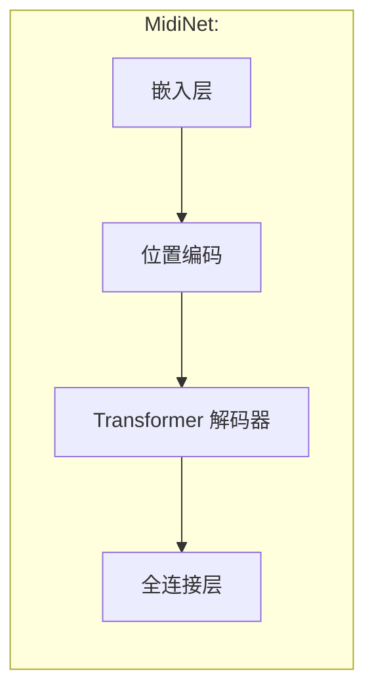
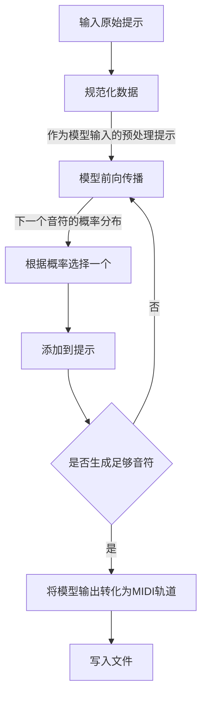
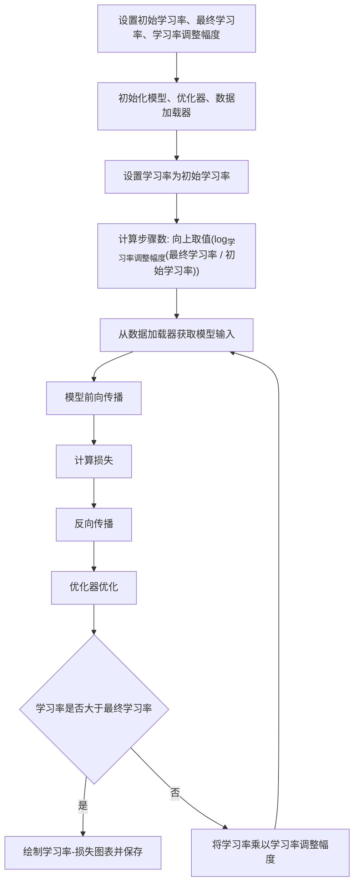

# Tk AI MIDI
## 简介
这是一个基于`TransformerDecoder`的MIDI生成模型。该模型利用`Transformer`架构的解码器部分。

## License

本项目采用[GNU AGPLv3 or later](https://www.gnu.org/licenses/agpl-3.0.html)许可证。您可以自由使用、修改和分发本项目的代码，但必须在相同许可证或其任何后续版本下进行。

## 各个文件的作用
### `model.py`
模型的结构代码。还有保存、加载模型和恢复训练所需的数据的工具函数。

### `utils.py`
一些训练和推理会用到的工具，包括转换MIDI为音符列表、规范化音符数据、清理缓存的函数

### `generate.py`
以下为生成MIDI的流程

### `train.py`
训练用的函数、数据集。

### `find_lr.py`
用于寻找最佳学习率。

### `play.py`
在循环规范化数据后，将其转换为MIDI文件以播放指定的MIDI文件或文件夹中的每一个MIDI文件，可以有效地测试规范化数据的结果。由于规范化过程可能会将时间差距较小的音符合并为同时播放，这可能导致在未开启严格模式的情况下，生成的MIDI文件出现混乱。因此，原则上，任何用于训练的MIDI文件都应通过这种方式进行检测，以确保其适合用于训练。

## 提醒
除`play.py`以外，其他文件都是在[Kaggle](https://www.kaggle.com/)上运行的，且数据集路径和平常环境不同，所以你需要修改代码以适应你自己的环境。

## 作者闲话
我刚写这个的时候没想到许可证的问题，后来写了很多个版本才突然想起来。当时听说`AGPL`非常自由，比`GPL`自由（因为使用以`AGPL`分发的软件的话，即使使用网络提供在线服务，也需要提供给用户源代码，而`GPL`不用），身为一个深受专有软件伤害的人（指玩远古游戏时因无法读取游戏文本进行翻译而抓狂，还有玩打牌王时想用AI训练自动打牌却无法导出录像），我觉得自由软件才是我的最佳选择。可惜很多自由的软件不好用，很多好用的软件不自由。更糟的是，有些软件即不好用、也不自由（迟早给扫进历史的垃圾堆里去）。

我一开始写的是多个全连接层的模型，**一次性**生成MIDI。感兴趣的可以去看看[远古版本](https://www.kaggle.com/code/yigk4out/tkaimidi?scriptVersionId=220360473)。

这个项目早期是在Kaggle上跑的，是后来搬到Github上的，所以看历史版本建议[去Kaggle看](https://www.kaggle.com/code/yigk4out/tkaimidi)，早期的名字时`musicmidi`。

还有谁知道还有什么**不用实名验证**的**免费**提供限时GPU的网站吗，请在`Issues`以`[推荐免费GPU网站] Google Colab`为模板提一下，谢谢！