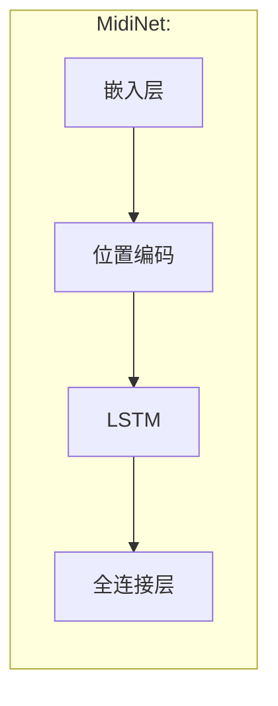
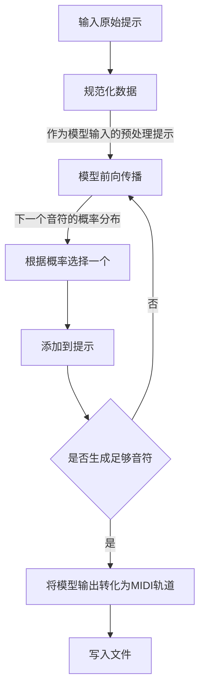

# Tk AI MIDI
## 简介
这是一个基于`LSTM`的MIDI生成模型，旨在通过深度学习技术生成音乐作品。

## License


TkTransl 是自由软件，遵循[Affero GNU 通用公共许可证）第 3 版或任何后续版本]((https://www.gnu.org/licenses/agpl-3.0.html))。你可以自由地使用、修改和分发该软件，但不提供任何明示或暗示的担保。有关详细信息，请参见 GNU 通用公共许可证。

## 安装与依赖
```bash
pip install -r requirements.txt
```

## 使用说明
对着`train.py`的`main()`的`config`变量改就是了，注释已经很清晰了。

### 运行程序
在命令行中运行以下命令以启动 TkTransl:
```bash
python tktransl.py
```

## 各个文件的作用
### `model.py`
模型的结构代码。还有保存、加载模型和恢复训练所需的数据的工具函数。


### `utils.py`
一些训练和推理会用到的工具，包括转换MIDI为音符列表、规范化音符数据、清理缓存的函数

### `generate.py`
以下为生成MIDI的流程


### `train.py`
训练用的函数、数据集。

## 贡献
欢迎任何形式的贡献，包括报告问题、提交功能请求或代码贡献。请遵循项目的贡献指南。

## 联系信息
如有任何问题或建议，请联系项目维护者 thiliapr。
- Email: thiliapr@tutanota.com

# 无关软件本身的广告
## Join the Blue Ribbon Online Free Speech Campaign!


支持[Blue Ribbon Online 言论自由运动](https://www.eff.org/pages/blue-ribbon-campaign)！  
你可以通过向其[捐款](https://supporters.eff.org/donate)以表示支持。

## 支持自由软件运动
为什么要自由软件: [GNU 宣言](https://www.gnu.org/gnu/manifesto.html)

你可以通过以下方式支持自由软件运动:
- 向非自由程序或在线敌服务说不，哪怕只有一次，也会帮助自由软件。不和其他人使用它们会帮助更大。进一步，如果你告诉人们这是在捍卫自己的自由，那么帮助就更显著了。
- [帮助 GNU 工程和自由软件运动](https://www.gnu.org/help/help.html)
- [向 FSF 捐款](https://www.fsf.org/about/ways-to-donate/)