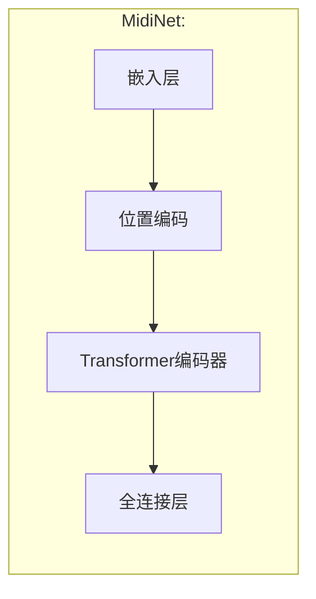

# Tk AI MIDI
## 简介
这是一个基于`TransformerEncoder`的MIDI生成模型。该模型利用`Transformer`架构的编码器部分。

## License

本项目采用[GNU AGPLv3 or later](https://www.gnu.org/licenses/agpl-3.0.html)许可证。您可以自由使用、修改和分发本项目的代码，但必须在相同许可证或其任何后续版本下进行。

## 各个文件的作用
### `model.py`
模型的结构代码。还有保存、加载模型和恢复训练所需的数据的工具函数。

### `utils.py`
一些训练和推理会用到的工具，包括转换MIDI为音符列表、规范化音符数据、清理缓存的函数

### `generate.py`
以下为生成MIDI的流程

### `train.py`
训练用的函数、数据集。

## 提醒
文件都是在[Kaggle](https://www.kaggle.com/)上运行的，且数据集路径和平常环境不同，所以你需要修改代码以适应你自己的环境。

## 作者闲话
我刚写这个的时候没想到许可证的问题，后来写了很多个版本才突然想起来。当时听说`AGPL`非常自由，比`GPL`自由（因为使用以`AGPL`分发的软件的话，即使使用网络提供在线服务，也需要提供给用户源代码，而`GPL`不用），身为一个深受专有软件伤害的人，我觉得自由软件才是我的最佳选择。可惜很多自由的软件不好用[^NotGoodButFree]，很多好用的软件不自由[^NotFreeButGood]。更糟的是，有些软件即不自由、也不好用（说你呢，微信、QQ还有国家反诈中心APP）。

这个项目早期是在Kaggle上跑的，是后来搬到Github上的，所以看历史版本建议[去Kaggle看](https://www.kaggle.com/code/yigk4out/tkaimidi)，早期的名字是`musicmidi`。

[^NotGoodButFree]: 如[MIDIEdtior(HTTPS证书都不注册)](http://www.midieditor.org/), [万年不支持HTTP3的Firefox(iwara.tv都看不了)](https://www.mozilla.org/zh-CN/firefox/new/)
[^NotFreeButGood]: 如[Cakewalk](https://www.bandlab.com/products/cakewalk), [Sublime Text](https://www.sublimetext.com/), [TeamViewer](https://www.teamviewer.com/), [Steam](https://store.steampowered.com/), [Minecraft](https://www.minecraft.net/), 一众Galgame等

## 其他
代码周更，文档年更
