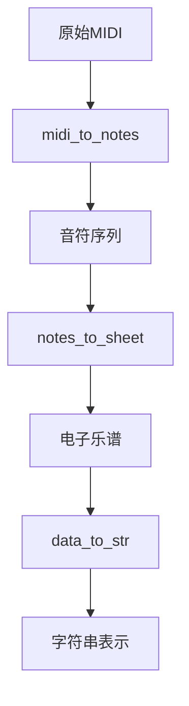

# MIDI 训练信息提取工具文档

## 功能概述
该工具用于从 MIDI 文件目录中提取训练所需的信息，包括：
- 音符序列数据
- 可训练位置索引
- 音符位置映射
- 电子乐谱表示

## 使用说明
### 命令行参数
| 参数 | 类型 | 默认值 | 说明 |
| - | - | - | - |
| `input_dir`| Path | 必填 | 包含MIDI文件的输入目录 |
| `output_dir` | Path | 必填 | 输出JSON文件的目录 |
| `-e/--max-sequence-length` | int | 131072 | 最大序列长度(超过将被截断) |

### 执行示例
```bash
python extract_midi.py /path/to/midi/files /path/to/output
```

## 处理流程
### 1. MIDI文件读取
- 递归扫描输入目录下的所有`.mid`文件
- 使用`mido`库读取MIDI文件
- 自动跳过损坏的文件

### 2. 音符提取与转换


### 3. 数据处理
- 过滤无效音符(零间隔音符)
- 记录可训练位置索引
- 建立音符到乐谱位置的映射
- 序列长度超过阈值时智能截断

### 4. 输出格式
每个MIDI文件对应一个JSON文件，包含以下字段：
```json
{
  "num_notes": "总音符数",
  "train_notes": "可训练音符索引数组",
  "positions": "对应音符在乐谱中的位置",
  "data": "电子乐谱的字符串表示"
}
```

## 文件结构
```
input_dir/
├── subdir1/
│   ├── file1.mid
│   └── file2.mid
└── subdir2/
    └── file3.mid

output_dir/
├── subdir1/
│   ├── file1.json
│   └── file2.json
└── subdir2/
    └── file3.json
```

## 错误处理机制
- 自动跳过损坏的MIDI文件
- 忽略不含有效音符的文件
- 保持原始目录结构
