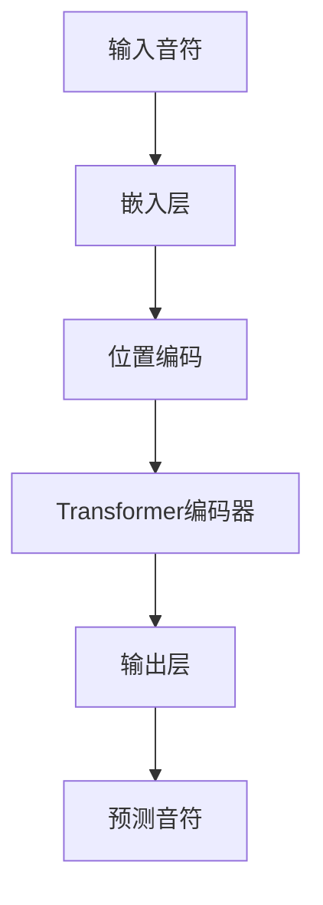

# MidiNet 模型文档
## 模型概述
MidiNet 是一个基于 Transformer 架构的 MIDI 音乐生成模型，包含位置感知嵌入模块和多层编码器结构。模型主要包含以下组件：

1. **位置感知嵌入模块** (PositionalEmbedding)
2. **多层 Transformer 编码器**
3. **音符预测输出层**

## 类说明
### PositionalEmbedding 类
#### 功能描述
实现结合自注意力机制和位置加权前馈网络的位置编码模块，包含：
- 多头自注意力机制
- 位置加权前馈网络
- 残差连接与层归一化

#### 初始化参数
| 参数名 | 类型 | 说明 |
| - | - | - |
| d_model | int | 输入特征维度 |
| dim_feedforward | int | 前馈网络隐藏层维度 |
| num_heads | int | 注意力头数 |
| dropout | float | Dropout 概率 (默认: 0.1) |
| device | torch.device | 计算设备 |

#### 前向传播方法
```python
forward(x: torch.Tensor, causal_mask: torch.BoolTensor, key_padding_mask: Optional[torch.BoolTensor] = None) -> torch.Tensor
```
##### 参数说明
- `x`: 输入张量 (batch_size, seq_len, d_model)
- `causal_mask`: 因果掩码 (batch_size, seq_len)
- `key_padding_mask`: 键填充掩码 (batch_size, seq_len)

##### 处理流程
1. 多头自注意力计算
2. 残差连接 + 层归一化
3. 位置加权前馈计算
4. 残差连接 + 层归一化

### MidiNet 类
#### 模型结构


#### 初始化参数
| 参数名 | 类型 | 说明 |
|--------|------|------|
| vocab_size | int | 音符词汇表大小 |
| d_model | int | 模型特征维度 |
| num_heads | int | 注意力头数 |
| dim_feedforward | int | 前馈网络维度 |
| num_layers | int | 编码器层数 |
| dropout | float | Dropout概率 (默认: 0.1) |
| device | torch.device | 计算设备 |

#### 关键组件
1. **嵌入层** (Embedding)
   - 使用 `sqrt(vocab_size)` 缩放嵌入向量
2. **位置编码模块**
3. **Transformer 编码器**
   - 包含多个标准 Transformer 编码层
4. **输出层**
   - 线性投影到词汇表空间

#### 权重初始化
- 嵌入层: 正态分布初始化
- 输出层: Kaiming 正态初始化 + 偏置归零

#### 前向传播方法
```python
forward(x: torch.Tensor, key_padding_mask: Optional[torch.BoolTensor] = None)
```
##### 处理流程
1. 生成因果掩码
2. 嵌入层处理输入
3. 应用位置编码
4. 通过 Transformer 编码器
5. 生成输出预测

## 注意事项
1. 输入张量应包含填充掩码 (key_padding_mask)
2. 因果掩码自动生成，防止信息泄露
3. 位置编码模块使用显式位置权重增强位置感知
4. 建议使用 GPU 设备加速训练

## 示例输入输出
```python
# 输入示例
input_tensor = torch.randint(0, vocab_size, (batch_size, seq_len))
mask = (input_tensor != pad_idx)

# 模型调用
output = model(input_tensor, key_padding_mask=mask)
```
