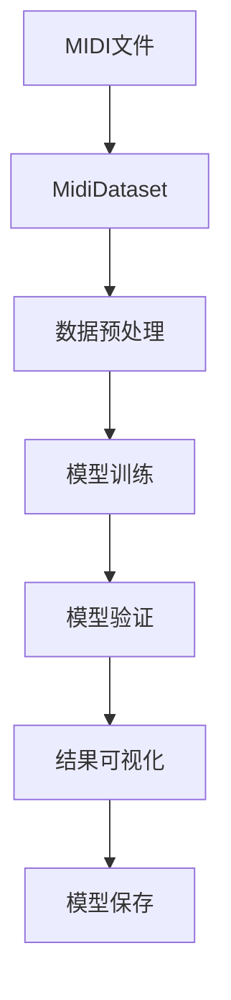

# MIDI 音乐生成模型训练系统文档
## 系统架构


## 核心模块说明
### 1. MidiDataset 数据集类
#### 功能特性
- 支持 MIDI 和 JSON 两种输入格式
- 自动处理损坏文件和无效数据
- 智能序列截断与分割
- 动态内存管理

#### 关键方法
| 方法 | 说明 |
| - | - |
| \__init__ | 初始化数据集并加载文件 |
| \__len__ | 返回可用样本总数 |
| \__getitem__ | 获取指定索引的样本 |

#### 数据处理流程
1. MIDI → 音符序列 → 电子乐谱 → 分词编码
2. 自动过滤：
   - 损坏的MIDI文件
   - 空音符序列
   - 超长序列(自动截断)

### 2. MidiDatasetSampler 采样器
#### 批处理策略
- 基于序列长度的动态批处理
- 自动计算最优批次组合
- 支持最大批次大小限制

#### 数学原理
根据经验，批次选择标准被设置为`sum(sequence_length ** 2) <= max_batch_size`

### 3. 训练与验证函数
#### 训练流程
```python
for batch in dataloader:
    optimizer.zero_grad()
    outputs = model(inputs)
    loss = criterion(outputs, labels)
    loss.backward()
    optimizer.step()
```

#### 验证流程
```python
with torch.no_grad():
    outputs = model(inputs)
    loss = criterion(outputs, labels)
```

### 4. 可视化模块
#### 生成图表包含
- 训练损失曲线 (红色实线)
- 验证损失曲线 (蓝色点线)
- 训练困惑度曲线 (绿色虚线)
- 验证困惑度曲线 (蓝色虚线)

## 配置参数说明
### 必需参数
| 参数 | 类型 | 说明 |
|------|------|------|
| num_epochs | int | 训练轮数 |
| ckpt_path | Path | 检查点路径 |
| --train-dataset | Path | 训练数据集路径 |

### 可选参数
| 参数 | 缩写 | 默认值 | 说明 |
|------|------|--------|------|
| --val-dataset | -v | None | 验证数据集路径 |
| --min-sequence-length | -m | 2³² | 最小序列长度 |
| --max-sequence-length | -e | 2¹⁷ | 最大序列长度 |
| --max-batch-size | -b | 8×1536² | 最大批次大小 |
| --learning-rate | -l | 0.01 | 学习率 |
| --weight-decay | -w | 0.01 | 权重衰减 |

## 性能优化措施
1. **内存管理**
   - 自动GPU缓存清理
   - 多线程优化
   - 智能批处理

2. **训练加速**
   - 多GPU支持(DataParallel)
   - 混合精度训练(自动检测)

3. **资源利用**
   - 解除线程限制
   - 进度条显示

## 使用示例
### 基本训练命令
```bash
python train.py 100 ckpt -t ./data/train -v ./data/val
```

## 检查点管理
### 保存内容
1. 模型参数 (`model.pth`)
2. 优化器状态 (`optimizer.pth`)
3. 训练指标 (`metrics.json`)

### 自动恢复功能
- 从中断处继续训练
- 兼容单机/多GPU模式
- 指标数据无缝衔接

## 最佳实践建议
1. **数据准备**
   - 建议使用JSON格式(加载更快)
   - 保持数据集平衡
   - 验证集比例建议20%

2. **训练技巧**
   - 初始学习率 1e-2 - 1e-3
   - 权重衰减 1e-2 - 1e-1
   - 每个epoch保存检查点

## 故障处理
### 常见问题
1. **内存不足**
   - 减小`max-batch-size`
   - 增加`min-sequence-length`

2. **训练不稳定**
   - 降低学习率
   - 增加权重衰减

3. **性能瓶颈**
   - 使用JSON替代MIDI
   - 减少数据增强操作
